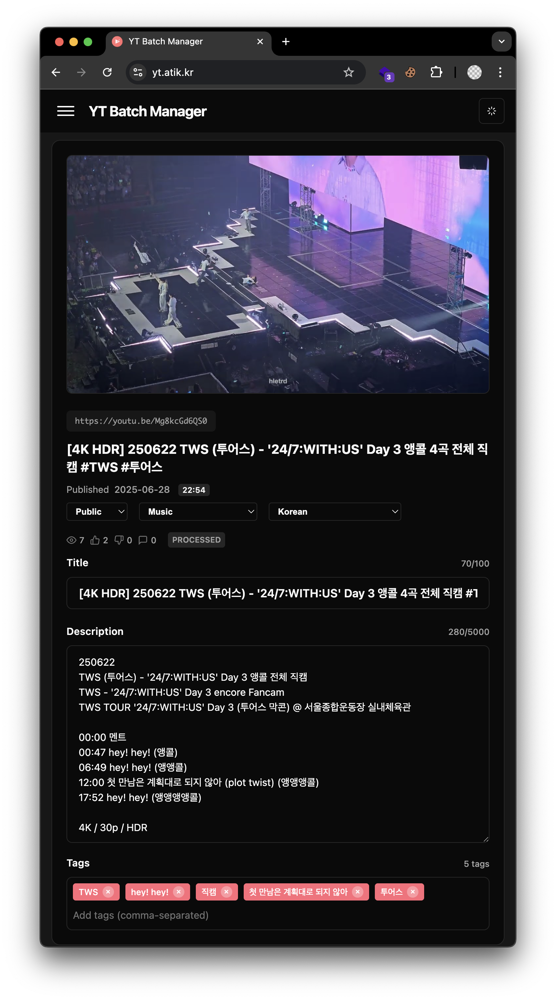
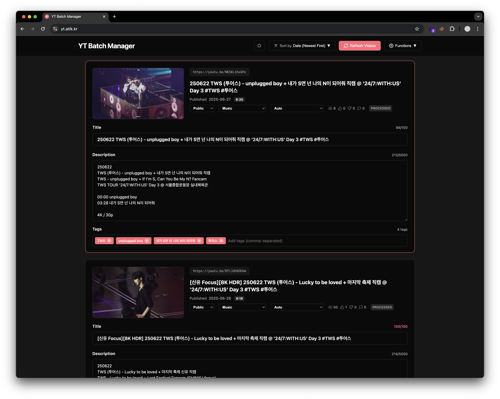
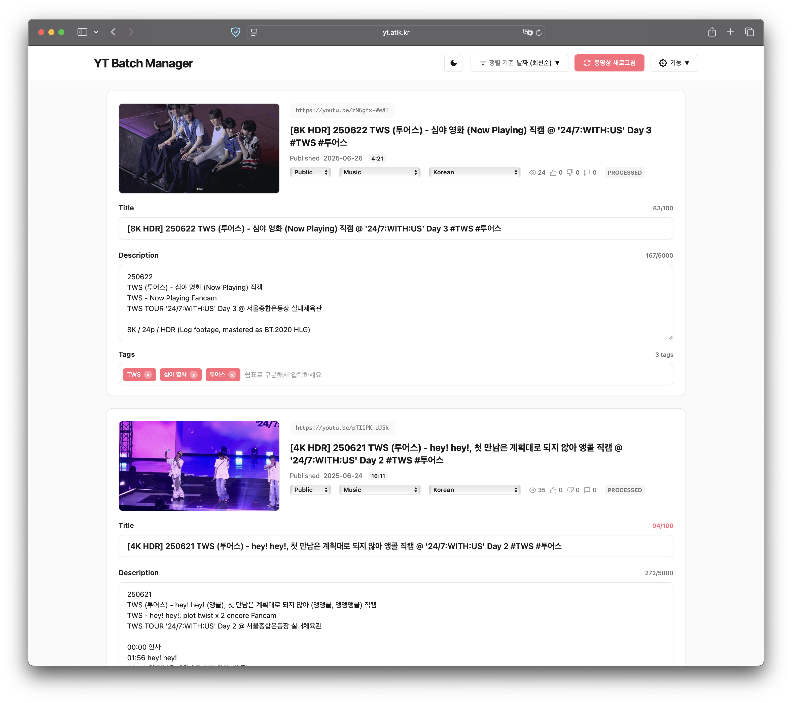

# YT Batch Manager Web







## [Go to the app](https://yt.atik.kr/)

* [Privacy Policy](https://yt.atik.kr/privacy)

## About

As both YouTube studio webpage and YT studio mobile app does not provide a convinient user experiences for batch editing video titles and descriptions, I had to make this app to manage titles and descriptions of my videos in a single place.

This is a web port of an [Electron port, as a standalone app](https://github.com/hletrd/yt-batch-manager), of [yt-batch-manager-py](https://github.com/hletrd/yt-batch-manager-py).

* Disclaimer: YouTube is a registered trademark of Google LLC, and this project is not affiliated with YouTube in any way.

## 설명

유튜브 채널의 영상 제목과 설명을 한 페이지에서 바로 수정하고 관리할 수 있는 앱입니다.

유튜브 채널에서 영상 제목과 설명을 한 번에 수정할 때 각 영상에 하나하나 들어가서 확인하고 수정해야 하는 게 너무 킹받아서 만들었습니다. 웹 페이지든 YT Studio 모바일 앱이든 왜 영상 제목과 설명을 한 번에 나열해서 수정할 수 있는 기능이 없는건지 모르겠습니다. 원래 [Python으로 만들었다가](https://github.com/hletrd/yt-batch-manager-py) 별도 데스크탑 앱이 편할 것 같아 [Electron으로 다시 만들었다가](https://github.com/hletrd/yt-batch-manager) 웹 페이지가 편한 것 같아 웹으로 다시 옮겼습니다.

---

## Features

* Edit video titles and descriptions in a single page, which YouTube does not allow.
  * YouTube forces a very user-unfriendly experiences, where you have to go to each video page to edit the title and description, and then save it.
* Save/load video data to/from local JSON files.

## 기능 (한국어)

* 유튜브 채널의 영상 하나하나를 각각 열지 않아도 한 번에 영상 제목과 설명을 편집할 수 있습니다.
  * 이거 유튜브 Studio 웹페이지나 YT Studio 앱에서는 안 됩니다. 대체 왜 안 되는지 모르겠습니다.
* 영상 제목과 설명을 JSON으로 저장하고 불러올 수 있습니다.
* 영상 공개 설정 / 카테고리 / 언어 / 태그 등도 한 번에 편집할 수 있습니다.

---

## Guide for developers

### Prerequisites

* Node.js 22.0.0+ installed.
* Google Cloud Console project with YouTube Data API v3 enabled.
* Your own YouTube channel.

### Setup

#### Install dependencies

```bash
$ npm install
```

#### Google API setup

##### Create a new project
1. Go to [Google Cloud Console](https://console.cloud.google.com/)
2. Create a new project, name it whatever you want.
3. Search for the **YouTube Data API v3** in the search bar, and enable it.
4. Search for the **OAuth consent screen** in the search bar, and navigate into it.
5. Click 'Get started'. Fill in the app name as whatever you want and user support email as your email address. Set audience to 'External'. Input your email addreess in 'Contact information'. Agree to the usage policy, and tap 'Create'.
6. click 'Clients' on the left sidebar.
7. Create a new client app as a web app, name it whatever you want.
8. Download the credentials JSON file, and rename it to `credentials.json`. Put it in the directory `src/`.

##### Add scopes
1. Search for the **OAuth consent screen** in the search bar, and click 'Data Access' on the left sidebar.
2. Click 'Add or remove scopes' and enter following scopes in **Manually add scopes** text box:
```
https://www.googleapis.com/auth/youtube
https://www.googleapis.com/auth/youtube.force-ssl
```
3. Click 'Add to table'.
4. Click 'Update'.
5. Click 'Save'.

##### Add yourself as a test user
1. Search for the **OAuth consent screen** in the search bar, and click 'Audience' on the left sidebar.
2. Click 'Add user' under 'Test users' and enter your email address.

#### Run the application (for development)

```bash
npm run dev
```

The application will launch and prompt for Google OAuth authentication on first run.

---

## Troubleshooting

### Google OAuth authentication fails
1. Remove the stored credentials by clicking the "Remove Saved Credentials" button and reload the file.
2. If the problem persists, try to re-create the `credentials.json` file.
